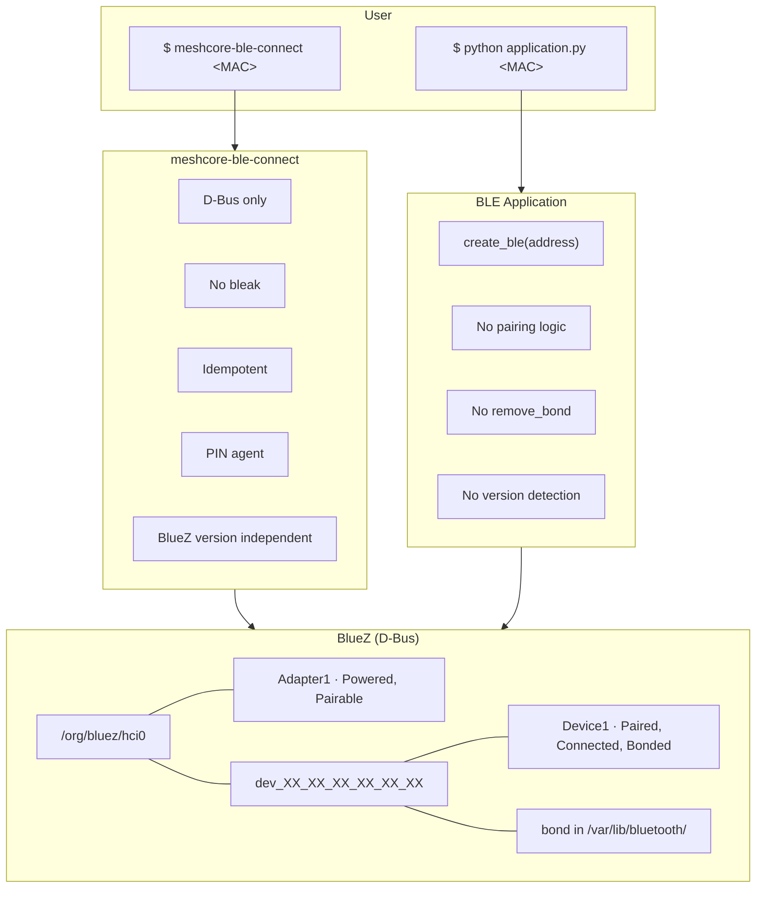
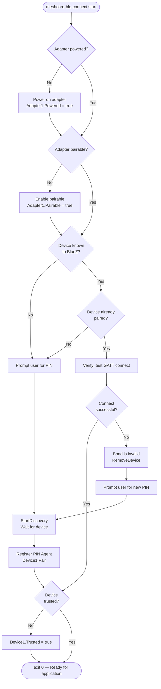
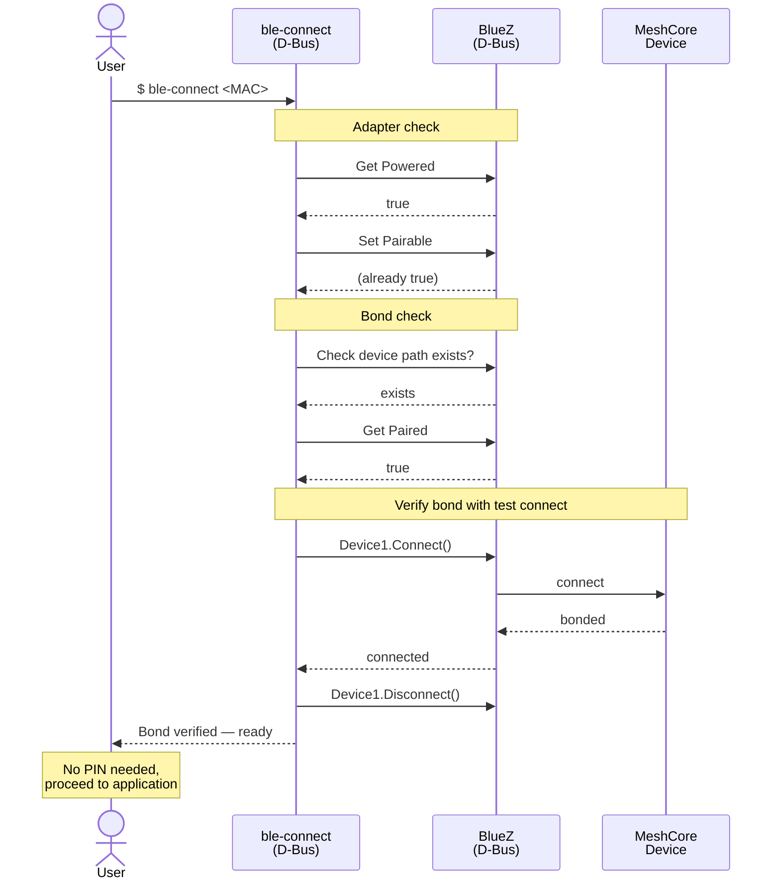
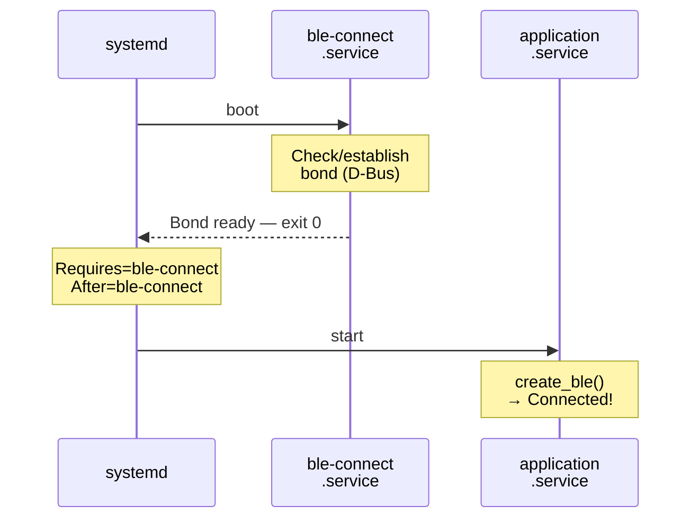

# BLE Connection Manager — Design Document

## 1. Problem

Applications that communicate with BLE devices often embed pairing and bonding logic directly in their codebase. This creates several problems:

- **Tight coupling to BlueZ internals.** Every BlueZ update (5.66 → 5.72 → 5.82) can change pairing behaviour, forcing conditional code paths and version detection in the application.
- **Wrong abstraction layer.** Libraries like bleak are GATT clients, not pairing tools. Using them for bonding leads to workarounds that break when the underlying stack evolves.
- **Difficult to test.** When pairing is woven into application logic, it cannot be verified or debugged in isolation.
- **Growing complexity.** Each BlueZ edge case adds another workaround, making the application harder to maintain.

**Root cause:** Pairing/bonding is an OS-level responsibility. It should be completed *before* any application starts — not managed by the application itself.

## 2. Solution

A **standalone BLE Connection Manager** (`meshcore-ble-connect`) that:

- Is independent of any application — can be used by meshcore-gui, scripts, or any other BLE client
- Communicates with BlueZ exclusively via D-Bus (not bleak or any GATT library)
- Guarantees the BLE bond before the application starts
- Is idempotent — safe to run multiple times
- Works across all BlueZ versions (5.66, 5.72, 5.82+)
- Can be tested, scripted, and debugged independently of the application it serves

## 3. Architecture

The system is split into two independent components. The connection manager handles all pairing via D-Bus. The GUI assumes a bond is already present and only performs GATT communication.



## 4. Connection Manager — Steps

The connection manager runs through a fixed sequence of D-Bus operations. Every step is idempotent: if the condition is already satisfied, the step is skipped.



| Step | Action | D-Bus Interface |
|------|--------|-----------------|
| 1 | Adapter powered? If not: power on | `Adapter1.Powered` |
| 2 | Adapter pairable? If not: enable | `Adapter1.Pairable` |
| 3 | Device known to BlueZ? | `Adapter1` / introspect |
| 4 | Device already paired? | `Device1.Paired` property |
| 5 | If paired: verify with test GATT connect | `Device1.Connect()` |
| 6 | If verify fails: remove invalid bond | `Adapter1.RemoveDevice()` |
| 7 | If PIN needed: prompt user interactively | stdin |
| 8 | If not paired: discover + start PIN agent + Pair | `Device1.Pair()` + `Agent1` |
| 9 | Device trusted? If not: trust | `Device1.Trusted = true` |

## 5. Scenarios

### 5.1 First-Time Pairing (no existing bond)

The device has never been paired. The connection manager runs through discovery, pairing with the PIN agent, and trust setup. After completion, the application can connect directly.

```mermaid
sequenceDiagram
    actor User
    participant BC as ble-connect<br/>(D-Bus)
    participant BZ as BlueZ<br/>(D-Bus)
    participant MC as MeshCore<br/>Device

    User->>BC: $ ble-connect <MAC>

    Note over BC,BZ: Adapter check
    BC->>BZ: Get Powered
    BZ-->>BC: true
    BC->>BZ: Set Pairable = true
    BZ-->>BC: OK

    Note over BC,BZ: Device discovery
    BC->>BZ: Check device path exists?
    BZ-->>BC: not found

    BC->>User: PIN required. Enter PIN:
    User->>BC: <PIN>

    BC->>BZ: StartDiscovery
    BZ<-->MC: BLE advertise
    BZ-->>BC: Device found
    BC->>BZ: StopDiscovery

    Note over BC,BZ: Pairing
    BC->>BZ: Register Agent (PIN)
    BC->>BZ: Device1.Pair()
    BZ->>MC: pair request
    BZ-->>BC: RequestPinCode
    BC->>BZ: PIN
    MC-->>BZ: pair ok
    BZ-->>BC: Pair complete

    Note over BC,BZ: Trust & verification
    BC->>BZ: Set Trusted = true

    BC-->>User: Bond ready

    Note over User,MC: Application start (bond is present)
    User->>BZ: $ application <MAC>
    Note right of BZ: create_ble(address)
    BZ->>MC: connect
    MC-->>BZ: bonded → GATT ok
    BZ-->>User: Connected!
```

### 5.2 Bond Verified (restart / reboot, device kept bond)

The device was previously paired and the bond is still valid on both sides. The connection manager verifies the bond with a test connect and exits immediately — no PIN is asked.



### 5.3 Invalid Bond — Device Rebooted with New PIN

The bond exists in BlueZ, but the device has lost its side (e.g. after a reboot or reflash). The test connect fails, revealing the invalid bond. The tool removes it, prompts the user for the new PIN, and re-pairs.

```mermaid
sequenceDiagram
    actor User
    participant BC as ble-connect<br/>(D-Bus)
    participant BZ as BlueZ<br/>(D-Bus)
    participant MC as MeshCore<br/>Device

    User->>BC: $ ble-connect <MAC>

    Note over BC,BZ: Adapter check
    BC->>BZ: Check Powered + Pairable
    BZ-->>BC: OK

    Note over BC,BZ: Bond check
    BC->>BZ: Get Paired
    BZ-->>BC: true

    Note over BC,MC: Verify bond with test connect
    BC->>BZ: Device1.Connect()
    BZ->>MC: connect
    MC-->>BZ: rejected (bond mismatch)
    BZ-->>BC: connect failed

    Note over BC: Bond is invalid

    BC->>BZ: RemoveDevice (clean slate)
    BZ-->>BC: OK

    BC->>User: Bond invalid. Enter new PIN:
    User->>BC: <NEW PIN>

    Note over BC,BZ: Re-discover & pair
    BC->>BZ: StartDiscovery
    BZ<-->MC: BLE advertise
    BZ-->>BC: Device found

    BC->>BZ: Register Agent + Pair
    BZ->>MC: pair
    Note over BZ,MC: PIN exchange
    MC-->>BZ: pair ok
    BZ-->>BC: Complete

    BC->>BZ: Set Trusted = true
    BC-->>User: Re-paired with new PIN
```

### 5.4 Force Repair (--force-repair)

The user knows the bond is bad and wants to skip the verify step. The `--force-repair` flag removes the device immediately and prompts for a PIN.

```mermaid
sequenceDiagram
    actor User
    participant BC as ble-connect<br/>(D-Bus)
    participant BZ as BlueZ<br/>(D-Bus)
    participant MC as MeshCore<br/>Device

    User->>BC: $ ble-connect <MAC> --force-repair

    Note over BC,BZ: Adapter check
    BC->>BZ: Check Powered + Pairable
    BZ-->>BC: OK

    Note over BC,BZ: Skip verify, remove directly
    BC->>BZ: RemoveDevice (clean slate)
    BZ-->>BC: OK

    BC->>User: Enter PIN:
    User->>BC: <PIN>

    Note over BC,BZ: Re-discover & pair
    BC->>BZ: StartDiscovery
    BZ<-->MC: BLE advertise
    BZ-->>BC: Device found

    BC->>BZ: Register Agent + Pair + Trust
    BZ->>MC: pair
    Note over BZ,MC: PIN exchange
    MC-->>BZ: pair ok
    BZ-->>BC: Complete

    BC-->>User: Re-paired
```

### 5.5 Systemd Integration — Daemon Mode

When deployed as a systemd oneshot service, the connection manager runs at boot before the application starts. The application service declares a dependency on the bond service.



## 6. CLI Interface

### 6.1 Usage

```bash
# Normal use — verifies bond, prompts for PIN only when needed
meshcore-ble-connect <MAC>

# Non-interactive — provide PIN upfront (for systemd / scripts)
meshcore-ble-connect <MAC> --pin <PIN>

# Check if bond exists and is valid (no pairing, no prompt)
meshcore-ble-connect <MAC> --check-only

# Skip verify, remove bond and re-pair (prompts for PIN)
meshcore-ble-connect <MAC> --force-repair

# Non-interactive force repair (for scripts)
meshcore-ble-connect <MAC> --force-repair --pin <PIN>

# Verbose output for debugging
meshcore-ble-connect <MAC> --verbose
```

The `--pin` flag is optional. When omitted and a PIN is needed, the tool prompts interactively. When provided, the tool runs non-interactively (suitable for systemd and scripting).

### 6.2 Exit Codes

| Code | Meaning |
|------|---------|
| `0` | Bond verified (test connect succeeded) — ready for application |
| `1` | Bond not present or invalid, and `--check-only` was used |
| `2` | Pairing failed (wrong PIN, device unreachable) |
| `3` | Adapter problem (not powered, not found) |
| `4` | D-Bus permission error |

### 6.3 Example Output

First-time pairing (interactive):

```
$ meshcore-ble-connect AA:BB:CC:DD:EE:FF
meshcore-ble-connect v1.0
BlueZ:    5.82
Adapter:  hci0 (powered, pairable)
Device:   AA:BB:CC:DD:EE:FF
Bond:     not found — pairing required
Enter PIN: ******
Agent:    registered
Pairing:  success
Trusted:  set
Result:   ✅ Bond established — ready to connect
```

Existing valid bond:

```
$ meshcore-ble-connect AA:BB:CC:DD:EE:FF
meshcore-ble-connect v1.0
BlueZ:    5.82
Adapter:  hci0 (powered, pairable)
Device:   AA:BB:CC:DD:EE:FF
Bond:     found (paired + trusted)
Verify:   test connect OK
Result:   ✅ Bond verified — ready to connect
```

Invalid bond after device reboot:

```
$ meshcore-ble-connect AA:BB:CC:DD:EE:FF
meshcore-ble-connect v1.0
BlueZ:    5.82
Adapter:  hci0 (powered, pairable)
Device:   AA:BB:CC:DD:EE:FF
Bond:     found (paired + trusted)
Verify:   test connect FAILED — bond is invalid
Cleanup:  removed invalid bond
Enter new PIN: ******
Agent:    registered
Pairing:  success
Trusted:  set
Result:   ✅ Re-paired — ready to connect
```

## 7. Technical Details

### 7.1 D-Bus Operations (no bleak!)

All communication goes through `dbus-fast`, the same library already used in the project.

```python
from dbus_fast.aio import MessageBus
from dbus_fast import BusType, Variant

bus = await MessageBus(bus_type=BusType.SYSTEM).connect()

# Adapter properties
adapter = proxy.get_interface("org.bluez.Adapter1")
props   = proxy.get_interface("org.freedesktop.DBus.Properties")

# Device properties (after discovery)
device_props = device_proxy.get_interface("org.freedesktop.DBus.Properties")
device_iface = device_proxy.get_interface("org.bluez.Device1")

# Pairing
await device_iface.call_pair()      # Triggers Agent1.RequestPinCode
await props.call_set("org.bluez.Device1", "Trusted", Variant("b", True))
```

### 7.2 PIN Agent (D-Bus native)

A minimal agent that only implements `RequestPinCode`. No passkey, no confirmation — just the static PIN required by MeshCore devices.

```python
class PairingAgent(ServiceInterface):
    def __init__(self, pin: str):
        super().__init__("org.bluez.Agent1")
        self._pin = pin

    @method()
    def RequestPinCode(self, device: 'o') -> 's':
        return self._pin

    @method()
    def Release(self):
        pass
```

### 7.3 Bond Verification (test connect)

After confirming a bond exists in BlueZ, the manager performs a short GATT test connect via D-Bus to verify the device still recognizes the bond. If the connect is rejected, the bond is invalid and needs to be re-established.

```python
# Verify via D-Bus Device1 interface (not bleak)
try:
    await device_iface.call_connect()
    # Bond is valid — disconnect and report success
    await device_iface.call_disconnect()
except DBusError:
    # Bond is invalid — remove and re-pair
    await adapter.call_remove_device(device_path)
```

This uses the same D-Bus `Device1.Connect()` method that BlueZ provides — no additional libraries are needed.

### 7.4 Discovery (only when device is unknown)

Discovery is only triggered when the device object path does not yet exist in BlueZ. The manager listens for the `InterfacesAdded` signal filtered by MAC address.

```python
await adapter.call_start_discovery()
# ... wait for InterfacesAdded with matching MAC ...
await adapter.call_stop_discovery()
```

## 8. Systemd Deployment

### 8.1 Bond Service (shipped by this repo)

Since systemd services are non-interactive, the `--pin` flag is required here. If the device reboots with a new PIN, the service file must be updated accordingly.

```ini
[Unit]
Description=MeshCore BLE Bond Setup
After=bluetooth.target

[Service]
Type=oneshot
ExecStart=/path/to/venv/bin/python \
    /path/to/meshcore_ble_connect.py \
    <MAC> --pin <PIN>
RemainAfterExit=yes

[Install]
WantedBy=multi-user.target
```

### 8.2 Consuming Application (example)

The application that depends on the bond ships its own service file and declares the dependency. This example uses meshcore-gui, but any BLE application can follow the same pattern:

```ini
# Shipped by the consuming application, NOT by meshcore-ble-connect
[Unit]
Description=My BLE Application
After=meshcore-ble-connect.service
Requires=meshcore-ble-connect.service

[Service]
ExecStart=/path/to/venv/bin/python \
    /path/to/application.py <MAC>

[Install]
WantedBy=multi-user.target
```

### 8.3 Boot Sequence

1. systemd starts `meshcore-ble-connect.service`
   - Bond exists? **Yes** → exit 0 (instant)
   - Bond exists? **No** → pair → exit 0
2. systemd starts the consuming application's service
   - Application calls `create_ble(address)` → connected (bond already present)

## 9. Example Integration: meshcore-gui

This section describes the concrete impact on meshcore-gui as a reference for integrating `meshcore-ble-connect` into any BLE application.

After adopting `meshcore-ble-connect`, the following can be **removed** from meshcore-gui:

**worker.py:**
- `_ensure_paired()` method — entirely
- `ensure_adapter_pairable()` import and call
- `NEEDS_PREPAIR` conditional paths (3 locations)
- `remove_bond()` calls (3 in worker, 1 in ble_reconnect)
- `_prepair_client` instance variable

**config.py:**
- `_get_bluez_version()` function
- `BLUEZ_VERSION` constant
- `NEEDS_PREPAIR` constant

**ble_reconnect.py:**
- `ensure_adapter_pairable()` function
- `remove_bond()` function
- `NEEDS_PREPAIR` conditional in reconnect_loop

The connect step in worker.py simplifies to:

```python
# Bond is guaranteed by ble-connect
await self._connect()
```

The reconnect loop simplifies to:

```python
async def reconnect_loop(...):
    for attempt in range(1, max_retries + 1):
        await asyncio.sleep(base_delay * attempt)
        try:
            connection = await create_connection_func()
            return connection
        except Exception:
            continue
    return None
```

## 10. Comparison

| Aspect | Embedded pairing | Standalone (ble-connect) |
|--------|------------------|--------------------------|
| Pairing | Inside application, via bleak | Standalone, via D-Bus |
| BlueZ version | Conditional code paths | Not relevant (D-Bus is universal) |
| Error handling | Exception cascade in async code | Clear exit codes, single responsibility |
| Testability | Cannot test in isolation | `--check-only` flag, exit codes |
| Recovery | Restart entire application | `--force-repair` and re-run |
| Application complexity | Pairing + connection + data | Connection + data only |
| Debugging | Mixed with application logic | Separate tool, separate logs |

## 11. File Structure

```
meshcore-ble-connect/
├── meshcore_ble_connect.py   # Connection manager (single file)
├── requirements.txt          # dbus-fast
├── README.md                 # Usage guide
├── docs/
│   └── DESIGN.md             # This document
└── systemd/
    └── meshcore-ble-connect.service
```

> **Note:** The consuming application (e.g. meshcore-gui) is responsible for its own service file and declares a dependency on `meshcore-ble-connect.service` via `After=` / `Requires=`. See [section 8](#8-systemd-deployment) for an example.
